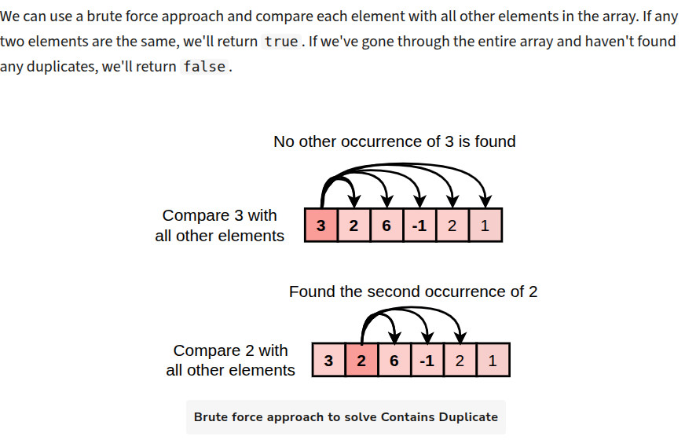

# Approach 1: Brute Force

# Complexity Analysis

## Time Complexity
1. Outer loop: The outer loop runs N times, where N is the length of the input array. This gives the outer loop a time complexity of O(N).

2. Inner loop (nested): For each iteration of the outer loop, the inner loop runs N - i - 1 times, which decreases as i increases. In the worst case, the inner loop will run approximately  times for the first element,  times for the second element, and so on. This results in a total time complexity for the inner loop of O(N^2)

## Space Complexity

- The algorithm only uses a few variables (i, j, and boolean result), all of which require constant space.
- No additional data structures are used that depend on the input size.
**Overall space complexity:** O(1)

[soln] (https://www.designgurus.io/course-play/grokking-the-coding-interview/doc/solution-contains-duplicate)